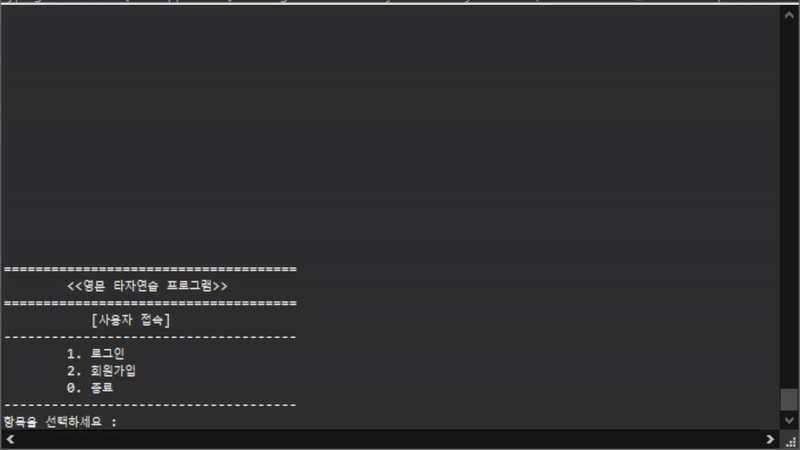
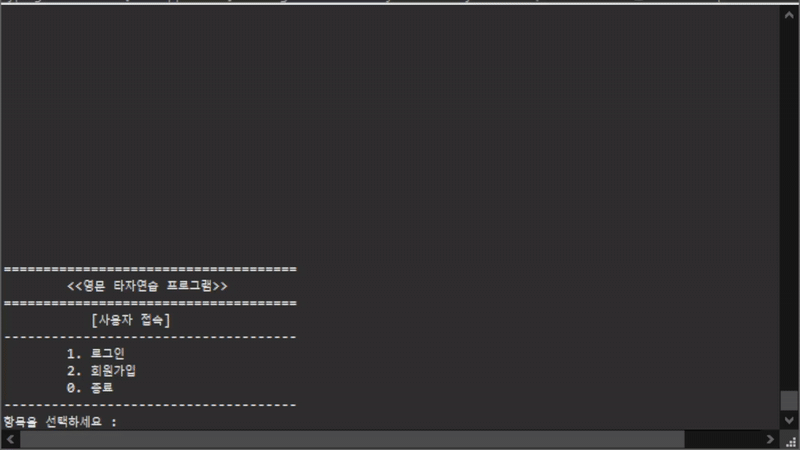
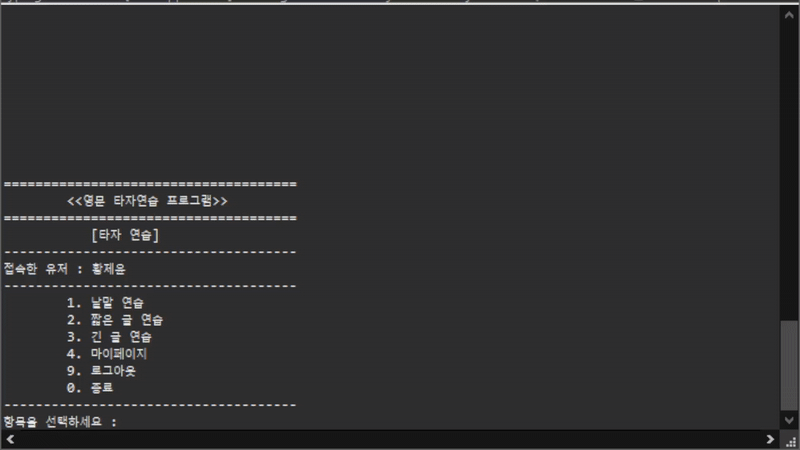
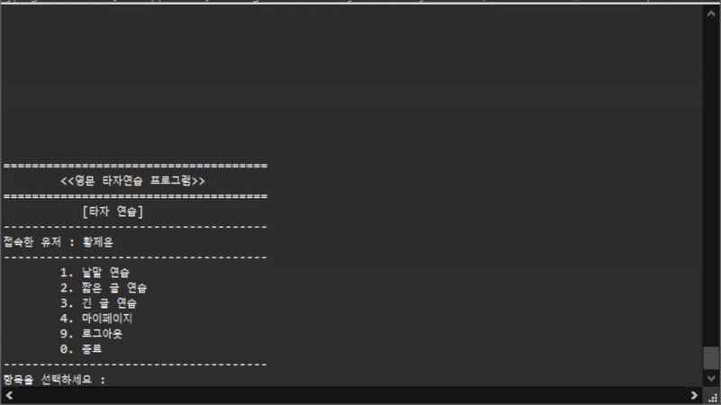
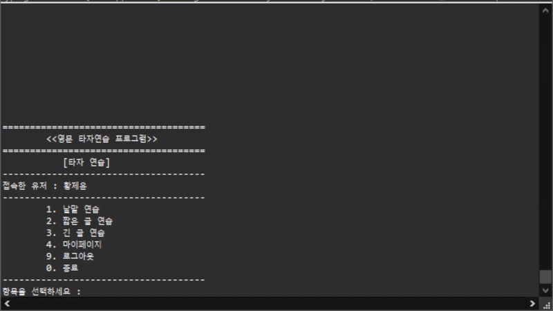
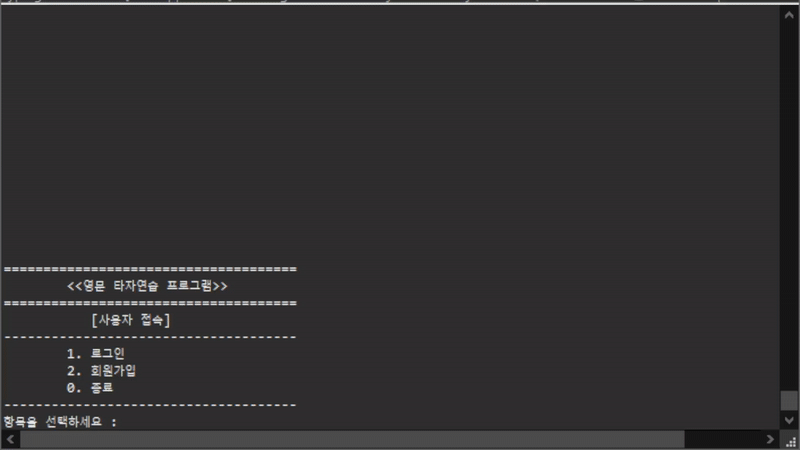
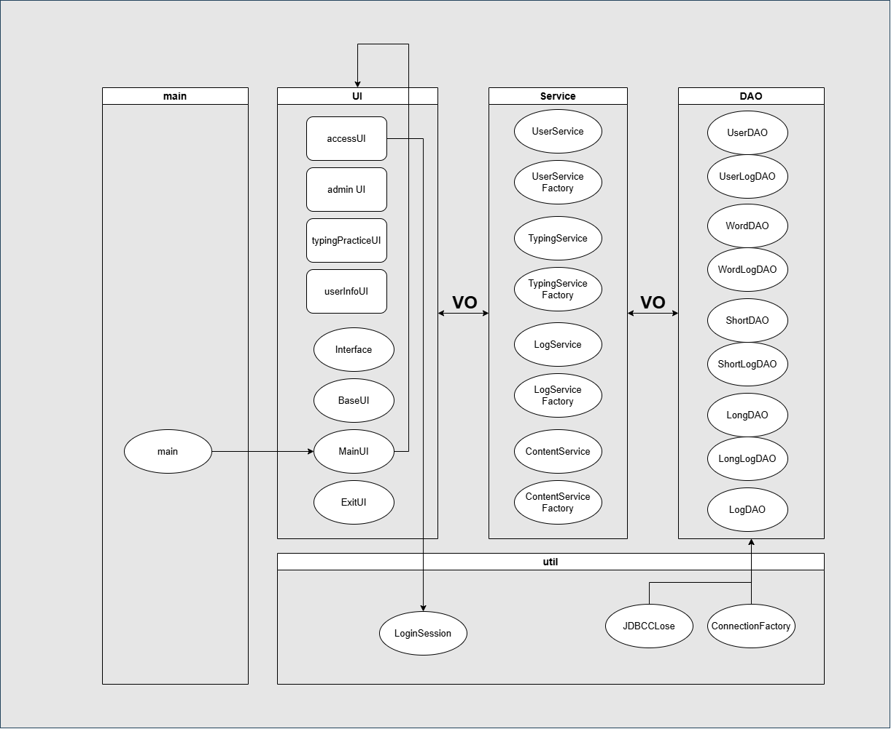
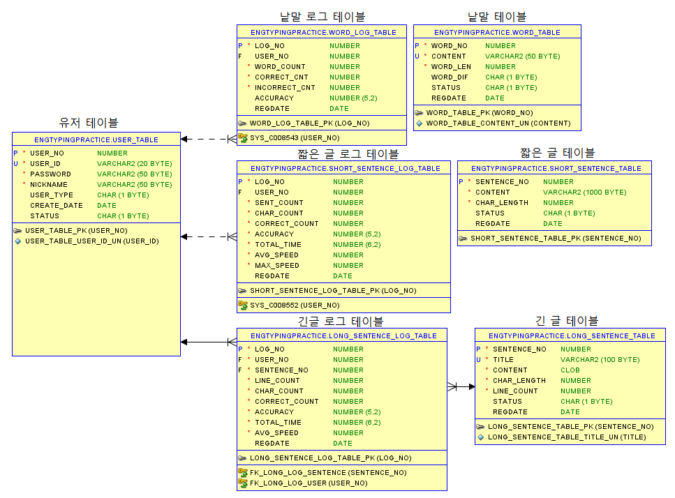

# 영문 타자 연습 프로그램 (Java Console Typing Practice)
Java 프로그래밍 학습과 **MVC 패턴 기반의 계층형 아키텍처를 직접 구현한** 콘솔(CLI) 기반의 영문 타자 연습 프로그램입니다. 신입 개발자들이 코딩에 필수적인 영문 타자 속도를 향상시키는 실용적인 목적과 함께, **역할과 책임을 분리하는 Java의 객체지향 구조 설계를 학습하는 것**을 목표로 하였습니다.
<p align="center"><br><em>사용 예시</em></p>

## 1. 주요 기능
### 👤 사용자 기능
*   **회원가입 및 로그인**: 사용자별로 계정을 생성하고 개인 기록을 관리할 수 있습니다.
*   **회원 정보 관리**: 닉네임, 비밀번호 변경 및 회원 탈퇴 기능을 제공합니다.
*   **개인 기록 조회**: 각 타자 연습 모드별 최고 타수, 평균 타수, 정확도 등 개인의 연습 기록을 상세히 조회할 수 있습니다.
<p align="center"><br><em>마이페이지 - 닉네임 변경/개인기록 조회</em></p>

### ⌨️ 타자 연습 기능
*   **낱말 연습**: 무작위로 제시되는 영단어를 입력하며 빠르고 정확하게 타이핑하는 기본 연습 모드입니다.
*   **짧은 글 연습**: 문장 단위로 나타나는 글을 따라 치며 문장 입력 능력을 기를 수 있습니다.
*   **긴 글 연습**: 여러 줄로 구성된 긴 글을 연습하며 지구력과 정확성을 함께 향상시킬 수 있습니다.
<p align="center"><br><em>낱말 연습</em></p>
<p align="center"><br><em>짧은 글 연습</em></p>
<p align="center"><br><em>긴 글 연습</em></p>

### 👑 관리자 기능
*   **사용자 관리**: 전체 회원 목록을 조회하고, 아이디 또는 닉네임으로 특정 사용자를 검색할 수 있으며, 사용자의 계정 상태(정지, 해제)를 변경할 수 있습니다.
*   **컨텐츠 관리**: 각 연습 유형(낱말, 짧은 글, 긴 글)별로 전체 컨텐츠 목록을 조회하고, 새로운 컨텐츠를 등록, 수정하거나 비활성화할 수 있습니다.
*   **로그 및 통계 조회**: 모든 사용자의 종합 통계, 연습 유형별 통계, 특정 사용자별 상세 연습 통계 요약을 조회하여 서비스 이용 현황을 파악할 수 있습니다.
<p align="center"><br><em>관리자 페이지 - 사용자 조회/컨텐츠 조회/통계 조회</em></p>

## 2. 기술 스택 및 아키텍처

### 사용 기술
*   **Language**: Java
*   **Database**: Oracle DB (JDBC)

### 아키텍처
이 프로젝트는 역할과 책임에 따라 계층을 명확하게 분리한 **계층형 아키텍처(Layered Architecture)**를 따릅니다.

*   `UI (User Interface)`: 사용자의 입력을 받고 결과를 출력하는 화면 로직을 담당합니다.
*   `Service`: 비즈니스 로직을 처리하며, UI와 DAO 계층을 연결하는 역할을 합니다.
*   `DAO (Data Access Object)`: 데이터베이스에 직접 접근하여 CRUD(생성, 조회, 수정, 삭제) 작업을 수행합니다.
*   `VO (Value Object)`: 계층 간 데이터 전송을 위한 객체입니다.
*   `Util`: 데이터베이스 커넥션, 세션 관리 등 공통으로 사용되는 유틸리티 기능을 포함합니다.

<p align="center">
  <!-- 아키텍처 다이어그램 이미지를 업로드하고 그 링크를 여기에 넣으세요. -->
  
  <br>
  <em>프로젝트 아키텍처 다이어그램</em>
</p>

### 데이터베이스 스키마 (ERD)
사용자 정보, 타자 연습에 사용될 컨텐츠(단어, 문장), 그리고 각 사용자의 연습 기록(로그)을 체계적으로 관리하기 위해 아래와 같이 데이터베이스를 설계했습니다.

<p align="center">
  <!-- ERD 이미지를 업로드하고 그 링크를 여기에 넣으세요. -->
  
  <br>
  <em>ERD</em>
</p>

## 3. 시작하기

### 사전 준비
*   JDK 11 이상
*   Oracle Database

### 실행 방법
1.  이 저장소를 클론합니다.
    ```bash
    git clone https://github.com/JeyunH/JavaConsole-EngTypingPractice.git
    ```
2.  Oracle DB에 접속하여 `sql`폴더의 `database_schema.sql` 스크립트를 실행해 테이블 및 초기 데이터를 생성합니다.
3.  `kr.ac.kopo.util.ConnectionFactory` 클래스에서 본인의 DB 접속 정보(URL, 사용자, 비밀번호)를 수정합니다.
4.  프로젝트를 컴파일하고 `kr.ac.kopo.main.TypingPracticeMain` 클래스를 실행합니다.

## 4. 향후 계획

현재 핵심적인 사용자 기능은 대부분 구현되었으나, 앞으로 아래 기능들을 추가하여 프로젝트를 발전시킬 계획입니다.

*   **타자 검정 기능**: 긴 글 연습과 유사하지만, 제한 시간을 두어 사용자의 실력을 객관적으로 측정하는 모드를 추가할 예정입니다.
*   **타자 게임 기능**: 간단한 게임 요소를 도입하여 타자 연습의 재미를 더하는 기능을 검토 중입니다.
*   **랭킹 시스템**: 여러 사용자의 타자 속도 순위를 보여주는 기능을 구현하여 동기부여를 제공할 예정입니다.

## 🧑‍💻 개발자

*   **황제윤** ([@JeyunH](https://github.com/JeyunH))
*   폴리텍 성남 하이테크과정[인공지능소프트웨어과]
